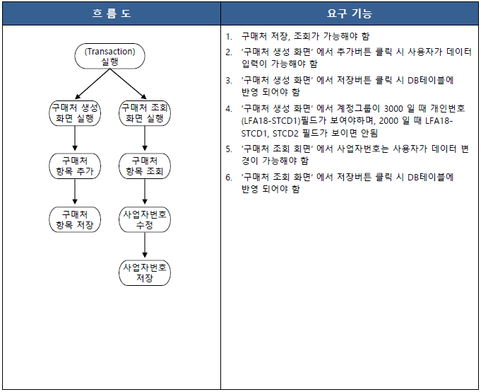
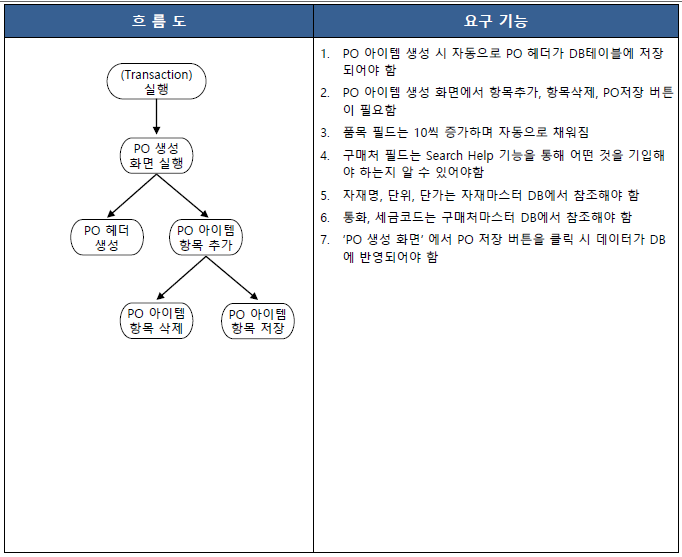

# SAP 구매처 및 구매오더(PO) 관리 시스템 개발

## 📌 프로젝트 개요

본 프로젝트는 '전사적 자원 관리' 수업의 과제로, SAP ERP 환경에서 자재 조달의 **구매처(Vendor) 마스터 데이터와 구매오더(Purchase Order, PO) 생성 및 조회**를 요구사항에 따라 개발한 프로젝트입니다.
---

## 🎯 개발 목표

- **구매처 관리 효율화**: 국내, 해외, 개인 등 계정그룹 조건에 따라 스크린 입력 필드를 동적으로 가시/비가시 입력 데이터 오류 예방
- **마스터 데이터 연동의 자동화**: 구매오더(PO) 아이템 작성 시, 자재 마스터 DB와 실시간 연동을 구성하여 자재 정보 및 거래 단가, 납품소요 일자를 자동으로 연산 및 반영
- **사용자 편의성 및 데이터 일관성 확보**: Search Help, Dropdown List Box 등의 표준 UI 요소를 효과적으로 구성하고, ALV 상에서 행 추가/삭제 기능 및 단체 처리를 단순화하여 사용자 조작 경험 개선

---

## 🛠 사용 기술

- **ERP Platform**: SAP GUI
- **Language**: ABAP
---

## 📈 주요 기능

- **구매처 마스터 동적 관리 (ZPROJECT18_001)**
  - 생성 및 조회 인터페이스 제공
  - 계정그룹(`KTOKK`) 선택 조건에 따른 개인번호, 사업자번호 입력창 제어 기능
  - 조회 결과 리스트상에서 사업자번호 수정 및 DB 저장 기능
- **구매오더(PO) 라이프사이클 처리 (ZPROJECT18_002)**
  - 신규 PO 아이템 추가 시 PO 헤더 정보 저장 기능 구성
  - 아이템 행 추가 시 품목 코드 자동 순번 스케일링 (10씩 자동 증가)
  - 자재 코드 입력 시 자재 마스터 DB 기반 연동 (자재명, 단위, 단가, 납품일 자동 기입)
  - 선택한 아이템 항목의 실시간 ALV 행 삭제 및 데이터 정합성 검증 후 최종 DB 반영

---


### 1. 프로세스 흐름도 (Flowcharts)

#### 1.1 구매처 생성 및 조회 프로세스 흐름도
사용자 실행 환경에 따라 생성과 조회 프로세스를 동적으로 분기하며, DB와 스크린 제어를 수행합니다.

<div align="center">
  
  <p><em>(PDF Page 3 - 구매처 생성 흐름도 및 요구 기능 정의 참고)</em></p>
</div>

#### 1.2 구매오더(PO) 생성 프로세스 흐름도
아이템 생성 시 마스터 데이터 연동 검증을 거쳐 최종적으로 트랜잭션 저장이 완료됩니다.

<div align="center">
  
  <p><em>(PDF Page 19 - PO 생성 흐름도 및 요구 기능 정의 참고)</em></p>
</div>

---

### 2. 데이터베이스 스키마 설계 (Database Tables)

#### 2.1 구매처 테이블 (`ZEDT18_015`)
* 회사코드와 구매조직은 `1100`으로 고정됩니다.

| Field Name | Key | Data Element | Description | Domain | Type | Length |
| :--- | :---: | :--- | :--- | :--- | :---: | :---: |
| **MANDT** | X | MANDT | 클라이언트 | MANDT | CLNT | 3 |
| **ZLFA_LIFNR** | X | ZLFA18_LIFNR | 구매처번호 | ZLFA18_LIFNR | CHAR | 10 |
| **ZLFA_KTOKK** | | ZLFA18_KTOKK | 구매처그룹 | ZLFA18_KTOKK | CHAR | 4 |
| **ZLFA_NAME1** | | ZLFA18_NAME1 | 구매처이름 | ZLFA18_NAME1 | CHAR | 30 |
| **ZLFB_BUKRS** | | ZLFB18_BUKRS | 회사코드 | ZLFB18_BUKRS | CHAR | 4 |
| **ZLFM_EKORG** | | ZLFM18_EKORG | 구매조직 | ZLFM18_EKORG | CHAR | 4 |
| **ZLFM_WAERS** | | ZLFM18_WAERS | 통화 | ZLFM18_WAERS | CUKY | 5 |
| **ZLFM_MWSKZ** | | ZLFM18_MWSKZ | 세금코드 | ZLFM18_MWSKZ | CHAR | 2 |
| **ZLFA_STCD1** | | ZLFA18_STCD1 | 개인번호 | ZLFA18_STCD1 | CHAR | 10 |
| **ZLFA_STCD2** | | ZLFA18_STCD2 | 사업자번호 | ZLFA18_STCD2 | CHAR | 10 |
| **ZLFA_STCD3** | | ZLFA18_STCD3 | 통관번호 | ZLFA18_STCD3 | CHAR | 10 |
| **ZLFA_ORT01** | | ZLFA18_ORT01 | 주소 | ZLFA18_ORT01 | CHAR | 50 |

#### 2.2 자재관리 마스터 테이블 (`ZEDT18_016`)

| Field Name | Key | Data Element | Description | Domain | Type | Length |
| :--- | :---: | :--- | :--- | :--- | :---: | :---: |
| **MANDT** | X | MANDT | 클라이언트 | MANDT | CLNT | 3 |
| **ZMARA_MATNR** | X | ZMARA18_MATNR | 자재코드 | ZMARA18_MATNR | CHAR | 10 |
| **ZMAKT_MAKTX** | | ZMAKT18_MAKTX | 자재명 | ZMAKT18_MAKTX | CHAR | 50 |
| **ZMARA_MEINS** | | ZMARA18_MEINS | 단위 | ZMARA18_MEINS | CHAR | 10 |
| **ZEINE_NETPR** | | ZEINE18_NETPR | 단가 | ZEINE18_NETPR | CURR | 13 |
| **ZEINE_WAERS** | | ZEINE18_WAERS | 통화 | ZEINE18_WAERS | CUKY | 5 |
| **ZEINE_APLFZ** | | ZEINE18_APLFZ | 납품소요시간 | ZEINE18_APLFZ | NUMC | 5 |

#### 2.3 PO 헤더 테이블 (`ZEDT18_017`)

| Field Name | Key | Data Element | Description | Domain | Type | Length |
| :--- | :---: | :--- | :--- | :--- | :---: | :---: |
| **MANDT** | X | MANDT | 클라이언트 | MANDT | CLNT | 3 |
| **ZEKKO_EBELN** | X | ZEKKO18_EBELN | 오더번호 | ZEKKO18_EBELN | CHAR | 10 |
| **ZEKKO_BUKRS** | | ZEKKO18_BUKRS | 회사코드 | ZEKKO18_BUKRS | CHAR | 4 |
| **ZEKKO_EKGRP** | | ZEKKO18_EKGRP | 구매그룹 | ZEKKO18_EKGRP | CHAR | 4 |
| **ZEKKO_EKORG** | | ZEKKO18_EKORG | 구매조직 | ZEKKO18_EKORG | CHAR | 4 |
| **ZEKKO_LIFNR** | | ZEKKO18_LIFNR | 구매처번호 | ZEKKO18_LIFNR | CHAR | 10 |
| **ZEKKO_BEDAT** | | ZEKKO18_BEDAT | 증빙일 | ZEKKO18_BEDAT | DATS | 8 |
| **ZEKKO_WAERS** | | ZEKKO18_WAERS | 통화 | ZEKKO18_WAERS | CUKY | 5 |

#### 2.4 PO 아이템 테이블 (`ZEDT18_018`)

| Field Name | Key | Data Element | Description | Domain | Type | Length |
| :--- | :---: | :--- | :--- | :--- | :---: | :---: |
| **MANDT** | X | MANDT | 클라이언트 | MANDT | CLNT | 3 |
| **ZEKPO_EBELN** | X | ZEKPO18_EBELN | 오더번호 | ZEKPO18_EBELN | CHAR | 10 |
| **ZEKPO_EBELP** | X | ZEKPO18_EBELP | 품목 | ZEKPO18_EBELP | INT2 | 5 |
| **ZEKPO_MATNR** | | ZEKPO18_MATNR | 자재코드 | ZEKPO18_MATNR | CHAR | 10 |
| **ZMAKT_MAKTX** | | ZMAKT18_MAKTX | 자재명 | ZMAKT18_MAKTX | CHAR | 50 |
| **ZEKPO_MENGE** | | ZEKPO18_MENGE | 수량 | ZEKPO18_MENGE | INT2 | 5 |
| **ZEKPO_MEINS** | | ZEKPO18_MEINS | 단위 | ZEKPO18_MEINS | CHAR | 10 |
| **ZEKPO_BPRME** | | ZEKPO18_BPRME | 단가 | ZEKPO18_BPRME | CURR | 13 |
| **ZEKKO_WAERS** | | ZEKKO18_WAERS | 통화 | ZEKKO18_WAERS | CUKY | 5 |
| **ZEKPO_PRDAT** | | ZEKPO18_PRDAT | 납품일 | ZEKPO18_PRDAT | DATS | 8 |
| **ZEKPO_WERKS** | | ZEKPO18_WERKS | 플랜트 | ZEKPO18_WERKS | CHAR | 4 |
| **ZEKPO_LGORT** | | ZEKPO18_LGORT | 저장위치 | ZEKPO18_LGORT | CHAR | 4 |
| **ZEKPO_MWSKZ** | | ZEKPO18_MWSKZ | 세금코드 | ZEKPO18_MWSKZ | CHAR | 2 |

---

### 3. 프로그램 개발 아키텍처
```text
ZPROJECT18_00X (Main Executable Report)
 ├── ZPROJECT18_00X_TOP : 변수, 내부 테이블, Work Area, ALV 인스턴스 전역 정의
 ├── ZPROJECT18_00X_CLS : CL_GUI_ALV_GRID 이벤트 감지용 이벤트 핸들러 클래스 구현
 ├── ZPROJECT18_00X_SCR : Selection-Screen 정의 (List Box, Radio Button 등 구성)
 ├── ZPROJECT18_00X_PBO : GUI status 매핑 및 ALV Container 생성 제어
 ├── ZPROJECT18_00X_PAI : 스크린 트리거 데이터 갱신 및 CRUD SQL 처리
 └── ZPROJECT18_00X_F01 : 주요 비즈니스 계산 및 DB 제어 Subroutines 정의
